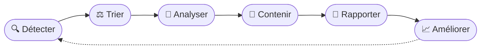

<!-- Bannière -->

  

  <a href="README.md">🇬🇧 English</a> · 🇫🇷 Français

  

---

## 👋 Salut

Moi c'est **Shyber**, **étudiante en ingénierie cybersécurité** passionnée par le domaine. Je m'y consacre en continu, à travers des labs, des projets et des exercices d'analyse, pour progresser et comprendre comment les attaques fonctionnent vraiment et comment les arrêter.

En ce moment, je suis surtout attirée par la **Blue Team :** **SOC et détection**, **réponse à incident**, **sécurité réseau**, **analyste sécurité**, **gestion des vulnérabilités** ainsi que **risques et conformité**. J'apprécie aussi le côté **offensif** de la sécurité et j'ai pour mission d'en apprendre et d'en maîtriser l'essentiel grâce aux labs et aux CTF le plus tôt possible !!!

---

## 🎯 Domaines d'intérêt

<table align="center">
  <tr>
    <td align="center" width="25%">
      <h3>🛡️</h3>
      <b>SOC & Détection</b> 
      Analyse de logs, SIEM, règles de détection d'intrusion
    </td>
    <td align="center" width="25%">
      <h3>🚨</h3>
      <b>Réponse à incident</b> 
      Investigation, playbooks, rapports d'incident clairs
    </td>
    <td align="center" width="25%">
      <h3>🌐</h3>
      <b>Sécurité réseau</b> 
      Analyse de trafic, pare-feu, SD-WAN, ZTNA
    </td>
    <td align="center" width="25%">
      <h3>📋</h3>
      <b>Risques & Conformité</b> 
      Audits de sécurité, NIST, RGPD, PCI DSS
    </td>
  </tr>
</table>

---

## 🧰 Boîte à outils

**Détection & analyse**

  
  
  
  
  
  

**Réseaux**

  
  
  
  

**Programmation & systèmes**

  
  
  
  
  

---

## 🔬 Projets réalisés

<b>🛡️ Détection & analyse d'incidents</b>

 

| Projet | Ce que j'ai fait | Outils |
|---|---|---|
| **Analyse d'une attaque SYN flood** | Analyse d'une capture TCP, identification de l'attaque provenant d'une IP externe, mesure de l'impact sur les clients légitimes et rédaction d'un rapport d'incident. | `Wireshark` `TCP` |
| **DDoS sur un serveur DNS** | Analyse de paquets capturés, documentation de l'incident et proposition de mesures correctives. | `tcpdump` |
| **Investigation d'un spear phishing** | Repérage des indicateurs (domaine usurpé, fautes d'orthographe, URL de collecte d'identifiants), vérification du hash d'un fichier suspect et application d'un playbook de réponse. | `VirusTotal` `Playbook` |
| **Règles de détection personnalisées** | Écriture de mes propres règles, passage de captures de paquets à travers celles-ci et analyse des logs générés. | `Suricata` |
| **Investigation de logs** | Requêtes sur des événements de sécurité avec deux langages de requête différents. | `Splunk (SPL)` `Chronicle (YARA-L)` |

<b>📋 Risques & conformité</b>

 

| Projet | Ce que j'ai fait | Référentiels |
|---|---|---|
| **Audit de sécurité interne (entreprise fictive)** | Évaluation de la conformité, remplissage d'une checklist de contrôles à partir de l'analyse de risques et rédaction de recommandations. | `NIST CSF` `RGPD` `PCI DSS` `SOC 1 & 2` |

<b>🌐 Réseaux & systèmes</b>

 

| Projet | Ce que j'ai fait | Outils |
|---|---|---|
| **Réseau sécurisé 3 tiers** | Émulation d'une architecture complète avec routage, commutation et protocoles de redondance. | `GNS3` `BGP` `MPLS` `OSPF` `VLAN` `NAT` |
| **Programmation système bas niveau** | Processus, threads, gestion de la mémoire, synchronisation et communication inter-processus. | `C` |
| **Automatisation de la sécurité** | Automatisation de petites tâches de sécurité avec des scripts. | `Python` |
| **Base de données de financement participatif** | Projet de groupe : développement d'une base de données complète et d'une application Python pour l'exploiter, à partir du besoin exprimé par le client. | `SQL` `mongoDB` `python` `plantUML` |

---

## 🔄 Ma façon d'aborder un incident

Une documentation claire compte autant que l'analyse technique : un bon rapport permet à quelqu'un d'autre d'agir rapidement.

---

## 🏅 Certifications

  
  

---

## 🌱 Sur mon radar

- Pratiquer davantage de labs et de challenges de type capture-the-flag
- Approfondir l'ingénierie de détection : écrire et affiner des règles
- Cloud Computing et sécurité du cloud
- Cybersécurité et IA

---

  <i>« Curieuse par nature, rigoureuse par habitude. »</i>

  

