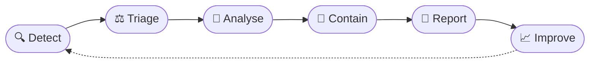

<!-- Header banner -->

  

  

---

## 👋 Hi there

I'm **Shyber**, a **cybersecurity engineering student** with a real passion for the field. I work on it constantly, through labs, projects and analysis exercises, to keep improving my skills and to understand how attacks really work and how to stop them.

Right now I'm most drawn to the **Blue Team :** **SOC and detection**, **incident response**, **network security**, **security analyst**, **vulnerability management** and **risk and compliance**.I also enjoy the **offensive** side of security and I have for mission to learn and master most of that with labs and CTFs as soon as possible!!!.

---

## 🎯 Areas of interest

<table align="center">
  <tr>
    <td align="center" width="25%">
      <h3>🛡️</h3>
      <b>SOC & Detection</b> 
      Log analysis, SIEM, intrusion detection rules
    </td>
    <td align="center" width="25%">
      <h3>🚨</h3>
      <b>Incident Response</b> 
      Investigation, playbooks, clear incident reports
    </td>
    <td align="center" width="25%">
      <h3>🌐</h3>
      <b>Network Security</b> 
      Traffic analysis, firewalls, SD-WAN, ZTNA
    </td>
    <td align="center" width="25%">
      <h3>📋</h3>
      <b>Risk & Compliance</b> 
      Security audits, NIST, GDPR, PCI DSS
    </td>
  </tr>
</table>

---

## 🧰 Toolbox

**Detection & analysis**

  
  
  
  
  
  

**Networking**

  
  
  
  

**Programming & systems**

  
  
  
  
  

---

## 🔬 Projects I've worked on

<b>🛡️ Detection & incident analysis</b>

 

| Project | What I did | Tools |
|---|---|---|
| **SYN flood analysis** | Analysed a TCP capture, identified the attack coming from an external IP, measured the impact on legitimate clients and wrote an incident report. | `Wireshark` `TCP` |
| **DDoS on a DNS server** | Analysed captured packets, documented the incident and proposed remediation. | `tcpdump` |
| **Spear phishing investigation** | Spotted the indicators (spoofed domain, spelling errors, credential-harvesting URL), checked a suspicious file hash and followed a response playbook. | `VirusTotal` `Playbook` |
| **Custom detection rules** | Wrote my own rules, ran packet captures through them and analysed the logs produced. | `Suricata` |
| **Log investigation** | Queried security events with two different query languages. | `Splunk (SPL)` `Chronicle (YARA-L)` |

<b>📋 Risk & compliance</b>

 

| Project | What I did | Frameworks |
|---|---|---|
| **Internal security audit (fictional company)** | Assessed compliance, completed a controls checklist from the risk assessment and wrote recommendations. | `NIST CSF` `GDPR` `PCI DSS` `SOC 1 & 2` |

<b>🌐 Networks & systems</b>

 

| Project | What I did | Tools |
|---|---|---|
| **Secure 3-tier network** | Emulated a full architecture with routing, switching and redundancy protocols. | `GNS3` `BGP` `MPLS` `OSPF` `VLAN` `NAT` |
| **Low-level systems programming** | Processes, threads, memory management, synchronisation and inter-process communication. | `C` |
| **Security automation** | Automated small security tasks with scripts. | `Python` |
| **Crowd Funding Database** | A group project where we developed a whole database and a python app to use it from the client's formulation. | `SQL` `mongoDB` `python`  `plantUML`|

---

## 🔄 How I think about an incident

Clear documentation matters as much as the technical analysis: a good report lets someone else act on it quickly.

---

## 🏅 Certifications

  
  

---

## 🌱 On my radar

- Practising more hands-on labs and capture-the-flag challenges
- Deepening detection engineering: writing and tuning rules
- Cloud Computing and Cloud Security
- Cybersecurity with AI 

---

  <i>"Curious by nature, careful by habit."</i>

  

>>>>>>> 0497db7 (Shyber's README V1)
